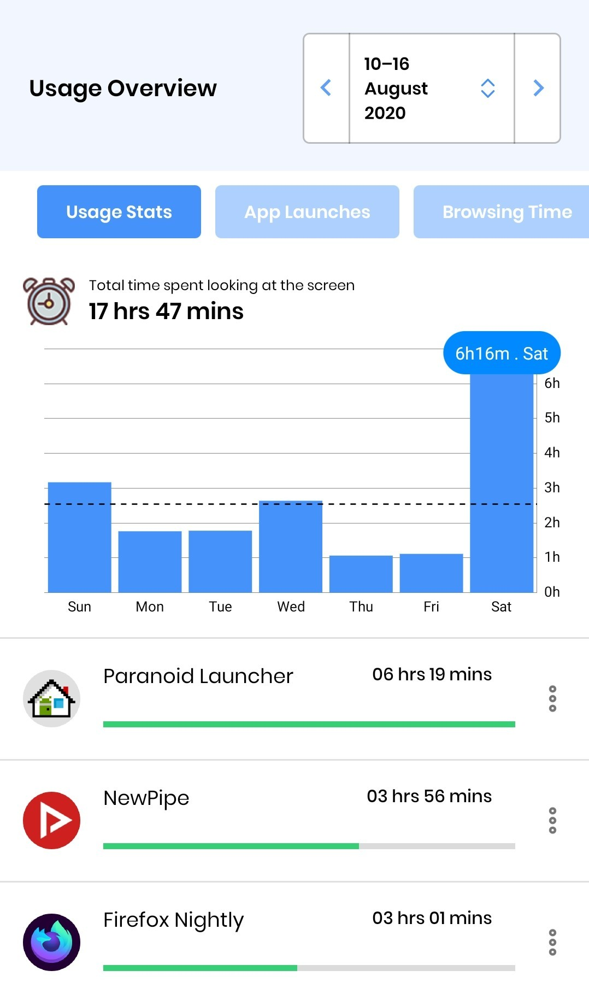

#### TL;DR
* **Use an app blocker on your phone, I recommend [StayFocusd](https://play.google.com/store/apps/details?id=com.stayfocused&hl=en_GB).**  
 Discipline works when you don’t have a choice, our monkey brains are no match for the world's best content recommendation algorithms and persuasive design. 

* **Plan your days flexibly using Google Calendar or a journal.**  
Think: I will do [event] at/after [trigger] in [location].  
Make sure to plan breaks, expect interruptions and things to go wrong.  

* **Shape your environment to support the right habits**  
Charging your phone by your bed, and using it as an alarm will make sure you check your phone each morning. This may be a bad habit.   

* **Consider journaling or using a habit tracker.**  
Getting into the habit of thinking about your habits will set you on your own self improvement journey.  

### First Steps
**Lets gather some data, Time Tracking**  
Both Android (Digital Wellbeing) and iOS (Screentime) have recently added some form of app tracking, take a look and you may be surprised to see you spending multiple hours on things that do not give you much value. 

If you are a heavy computer user, try RescueTime.  
If you care about productivity at work and can't install things, use Toggl or manually log your time in Google Calendar or in a journal.   
You will be surprised at how unproductive you really are. 

This is important as we all have our own addictions. Tracking my usage showed me my **YouTube addiction**. The key to tackling this has been to recognise that the recommendation algorithm is the problem, not YouTube itself. Therefore instead of blocking the website, I sign out of YouTube and use the NewPipe Android app. Using Firefox Focus instead of Firefox has helped a lot. 

**Whats next?**  
Digital Minimalism by Cal Newport would recommend a “Digital Detox”, where all optional technologies are removed for 30 days.  

I believe a less strict declutter is extremely useful and that experimenting is key. 
More info [here](https://www.reddit.com/r/digitalminimalism/wiki/declutter-guide).  

Atomic Habits by James Clear, would recommend making a Habit Scorecard, a list of your daily habits, each with a positive, neutral or negative label. This combined with your usage data tells you how long you might spend doing certain digital habits.   

For example, I realised that I would spend 3 hours in the morning on my phone, this was because I had my charger by my bed. After buying a cheap alarm and putting my phone on charge for an hour before I went to sleep, I saved 3 hours a day and improved my sleep hygiene drastically.   

### General Principles:
Productivity is a deeply personal thing, because it involves many tradeoffs. Some key ones I consider are:  

  * Productivity vs Privacy
  
  * Productivity vs Cost
  
These tradeoffs are multi layered, you may give up security for privacy by using a custom Android ROM or try to increase your productivity by buying unethically produced products. 

Digital Minimalism mentions that for all the technology you use, you should easily be able to say what deeply rooted values of yours it supports and how exactly you use it to lead the life you want to lead.

You need to decide for yourself what works for **you**.

#### Plan your time:
**If you don’t plan your time, something will plan it for you.**  
In the modern world, I know my attention is valuable and highly sought after. 
Advanced content recommendation algorithms and dopamine machines made by humanities smartest minds are fighting against your ancient brain. Who do you think is winning?

By explicitly scheduling your time and attention, it will soon become obvious who is trying to take it away from you. You shouldn’t take kindly to them. 

I am not suggesting you get rid of all leisure time, but instead **get rid of all low quality time and replace it with high quality time.**   
Instead of texting a friend while watching TV, not being able to focus properly on either activity, schedule in an hour to video chat or play a game together.   
Instead of laying in bed and binging random Youtube videos for an hour, watch or listen to them while cleaning, or even better listen to a podcast or audiobook instead. (See books listed below.)  

Find a way that works for you but my approach is to outline what I want to do each day as a checklist in my journal, then schedule a rough time in Google calendar. I make sure to leave an hour or two, knowing that things take longer than usual. 

Throughout the day, I then update and move my calendar events and check them off my journal.

At the end of the day and as part of my nightly routine, I then look back at my journal and consider what went right, what went wrong, and move over events I did not manage today to the next day. 

At the end of the week, I then look back and spot patterns as well as look at my Stayfocused data and then may decide to block or remove apps for the next week if needed. This time to reflect becomes increasingly important during life changes. In a large city, I need to use more tech to keep up with uncertainty and use apps like Google Maps. In a town, where I can walk everywhere, I might not even need a phone and all the distractions they bring. 

### Current Setup
**Android Phone:**  
Stayfocused, Journal, Google Calendar Scheduling, Popular Phone with custom ROM and Island for Privacy. 

**Daily Planning:**  
Journal: Outline in the morning, review at night, conduct weekly review.  
Google Calendar:  Rough plan after morning journal, update during nightly review.  

**Other:**  
Bose QC35ii: Good noise cancelling headphones have saved my sanity.

### For more infomation:
* The Social Dilemma, Netflix [9/10]  
Expected this to be basic but was pleasantly surprised, when it contained more programmers than any other documentary I have seen. Including the inventor of the YouTube recommendation algorithm recommending to remove it. 

**Books and Audiobooks**  
I always recommend reading “self help” via an audiobook and noting down key points because of the low signal to noise ratio. 
 
* Atomic Habits, James Clear. [9/10]  
Short and full of actionable techniques. 

* Deep Work, Cal Newport. [8/10]  
Emphasises focused deep flow inducing work, more actionable than his other work.

* Digital Minimalism, Cal Newport. [7/10]  
Brings up some interesting actionable points but later chapters include strange boomerisms like electronic music being inferior to dad rock because technology is bad.

